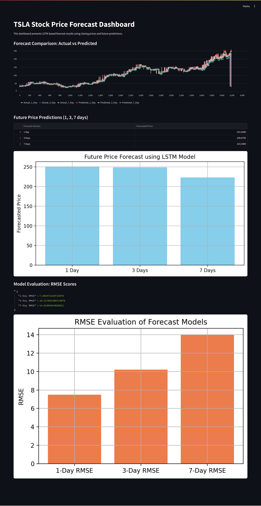

```markdown
# 📈 TSLA Stock Price Forecasting Using LSTM + Streamlit Dashboard

This project implements a **Long Short-Term Memory (LSTM)** deep learning model to forecast **Tesla (TSLA)** stock prices over multiple time horizons (1-Day, 3-Day, and 7-Day forecasts). The project also includes an interactive **Streamlit dashboard** to visualize the actual vs predicted prices, RMSE evaluation, and future price forecasts.

---

##  Project Overview

This project has two main parts:

1. **LSTM-based Time Series Forecasting**  
   - Built, trained, and evaluated 3 different LSTM models to predict TSLA closing prices over 1-day, 3-day, and 7-day windows.
   - Used Root Mean Squared Error (RMSE) for model evaluation.

2. **Interactive Dashboard using Streamlit**  
   - Visualizes actual vs predicted prices, RMSE evaluation charts, and future price forecasts.
   - Enhances interpretability and user interaction.

---

##  Project Structure

```

├── dashboard.py                # Main Streamlit dashboard script
├── forecast\_comparison.csv     # Actual vs Predicted dataset for dashboard
├── future\_forecasts.csv        # Future 1, 3, 7 day predictions
├── rmse\_results.json           # RMSE evaluation results
├── models/
│   ├── model\_1\_day.h5          # Trained LSTM model (1-Day)
│   ├── model\_3\_day.h5          # Trained LSTM model (3-Day)
│   └── model\_7\_day.h5          # Trained LSTM model (7-Day)

````

---

## 🛠️ Technologies Used

- **Python**
- **Pandas**, **NumPy**
- **TensorFlow/Keras**
- **Matplotlib**
- **Streamlit** for dashboard
- **LSTM** (Long Short-Term Memory Neural Network)

---

##  Model Development Process

### Step 1: Data Preparation
- Historical TSLA stock price data was loaded.
- Data was normalized and split into training and testing sets.
- Sequences of time steps were created as input features for LSTM.

### Step 2: LSTM Model Creation
- Three LSTM models were built for different forecast windows:
  - `model_1_day.h5`
  - `model_3_day.h5`
  - `model_7_day.h5`
- Each model used a sequence of the past 10 days to predict the next closing price(s).
- Mean Squared Error was used as the loss function.

### Step 3: Model Evaluation
- RMSE was calculated for each forecast:
  - **1-Day RMSE**: ~7.48
  - **3-Day RMSE**: ~10.22
  - **7-Day RMSE**: ~14.01
- These scores were saved in a `rmse_results.json` file.

### Step 4: Forecasting
- Models predicted the next 1, 3, and 7-day TSLA closing prices.
- Forecasts were saved into `future_forecasts.csv`.

---

##  Dashboard Features

Run the Streamlit dashboard to explore the visual results:

```bash
streamlit run dashboard.py
````

### 1.  Forecast Comparison: Actual vs Predicted

* Line chart showing how well the model predicted historical prices.
* Includes actual and predicted curves for all three forecast models.

### 2.  Future Price Predictions

* Displays the next predicted prices (1, 3, 7 days) as a bar chart.
* Shows forecasted values in a clean table.

### 3.  RMSE Evaluation

* JSON-style metrics display for each model's RMSE.
* Also visualized using a bar chart.

---

##  Sample Dashboard Screenshots



---

##  Setup Instructions

### 1. Create and activate a virtual environment:

```bash
python3 -m venv venv
source venv/bin/activate
```

### 2. Install dependencies:

```bash
pip install -r requirements.txt
```

Alternatively:

```bash
pip install streamlit pandas matplotlib tensorflow
```

### 3. Run the dashboard:

```bash
streamlit run dashboard.py
```

---

## 🧾 Output Files

* `forecast_comparison.csv` — Actual vs predicted values for dashboard.
* `future_forecasts.csv` — Output from LSTM models for the next 1, 3, and 7 days.
* `rmse_results.json` — RMSE evaluation scores for all models.
* `model_x_day.h5` — Saved LSTM models for reuse.

---

##  Future Improvements

* Integrate live stock data from an API (e.g., Yahoo Finance, Alpha Vantage).
* Add sentiment analysis from Twitter data.
* Include confidence intervals for forecast values.
* Deploy dashboard on **Streamlit Cloud** or **Heroku**.

---


## 📜 License

This project is licensed under the MIT License.

```
